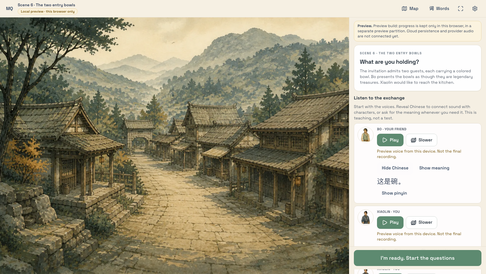

# The Seven-School Supper — lesson review

Course revision **1.1.0**, proposed for review. Ten scenes, twenty short teaching nodes,
50 primary vocabulary targets, 100 listening questions, five existing construction
activities, and twenty reserved listening-check items. Mandarin and Polly pronunciation
still need fluent-speaker review; this draft makes no measured learning-effectiveness claim.

## Story and characters

Seven sword schools gather for a festival supper. Xiaolin has an invitation and a plan.
Bo, an apprentice cook, has their entry bowls and a habit of helping strangers. Finding
Bo is the first half of the episode; reaching the supper together is the second.

- **Xiaolin (the learner's role):** organized, impatient with detours, willing to ask again
  instead of pretending to understand. Learns why Bo gets distracted.
- **Bo:** an ambitious cook, warmhearted, confidently bad at following the plan. His missing
  bowl turns out to have fed a hungry traveler. At the end he shares a discovery with
  Xiaolin before running off.
- **The gatekeeper:** patient, dryly amused, a recurring witness to both friends' habits.

The world draws on martial-arts journeys and cooking adventures. These are original
characters and events, not an adaptation of a named property's cast or plot. The existing
five environments are revisited; this PR does not add cinematic animation or new art.

## Ten-part episode

| Scene | What happens | Listening focus |
| --- | --- | --- |
| 1. The invitation | Xiaolin introduces themself and the missing friend. | Identity, pronouns, possession |
| 2. A cook in the crowd | Hats and guesses fail; Xiaolin asks for a location. | Who, where, presence and absence |
| 3. The tempting shortcut | A delicious smell tempts Xiaolin across the bridge. | Going, staying, waiting |
| 4. The noisy message | A practice gong interrupts an instruction; Xiaolin asks again. | Understanding and conversational repair |
| 5. The wandering apprentice | Bo arrives, having been looking for Xiaolin too. | Arrival, seeing, group suggestions |
| 6. The two entry bowls | Bo makes choosing a bowl unnecessarily complicated. | Bowl, this one, red and blue |
| 7. The confident wrong turn | Xiaolin asks for directions instead of trusting a gesture. | Left, right, bridge, there |
| 8. An empty hand | One bowl is missing; the friends search a shelter. | Have / do not have, inside / outside |
| 9. A better kind of hero | Bo admits lending the bowl to a hungry traveler. | Help, give, thanks, apology |
| 10. A place at the table | They reach the kitchen; a sealed recipe hints at another adventure. | Noodles, starting, tasty, tomorrow |

Story setup and node transitions appear during teaching. Resolutions appear only after
completing the scene. Questions keep the neutral scenery strip so these passages cannot
remain visible beside an unanswered listening question. Plot context can still help a
learner guess: practice success is not independent evidence of transfer.

## Listening first, characters second

Teaching now starts with the exchange. Every spoken line initially hides Chinese, pinyin,
and English. Learners may reveal Chinese and meaning independently; pinyin is another
optional support inside the Chinese reveal. New learners get pinyin on request; existing preferences are preserved.
An always-on pinyin preference applies only
after Chinese is revealed. The scenery identifies the speaker without displaying subtitles.
Vocabulary cards and grammar notes remain available in an expandable teaching section.

Each node also offers optional sound-to-character matching using its familiar lines.
A completed real playback is required before choosing a written line; simulated or failed
playback cannot produce recognition feedback. Feedback is local to the activity, does not
emit listening grades, and never changes a review schedule. Reserved checkpoint lines
cannot enter this activity.

The new questions use contrasts such as left/right, inside/outside, presence/absence,
and who gives something to whom. Existing exercises e004 and e033 now directly assess
是 and 说 rather than crediting those targets from whole-sentence gist recognition.

## Progress and release behavior

The revision preserves all existing node, target, and checkpoint IDs. Old checkpoint
exposure remains exposure, even after an upgrade. The ten original reserved items remain
unchanged; ten additional items cover new combinations from the extension. The complete
check opens after scene ten. Signed-in progress already projects stable IDs across course
revisions; local progress now advances a completed former finale to scene six on upgrade.
Queued events retain their original course identity.

The audio manifest must cover every utterance and primary target, both speeds, the four
cues, and the required construction-support sources. This draft also warms 吃 and 很.
Unchanged recipes are reused; new recordings use the same Polly Zhiyu neural voice.
Character portraits distinguish speakers, but this is not a distinct-voice listening test.
Deployment uses the existing stage → strict audio verification/import → activate sequence.

## Review this PR

Read the scene setups and resolutions in order, then try scene one and the transition from
five to six. Try a new lesson with Chinese hidden, then reveal Chinese without English.
Check that the new distractors require attention to the word or relationship being taught.
Play both speeds in the QA page, especially the new bowls, directions, requests and food
lines. This is an editorial draft: verify Mandarin naturalness, pinyin and pronunciation
before marking either provenance review flag true.

## Executed validation

- Generated 144 new Polly recordings; 312 ready assets cover 314 source mappings for
  revision 1.1.0. Strict import verification found no missing objects, conflicts, or
  missing mappings, with generation disabled.
- Played a new scene-ten line at normal and slow speed in Chromium and WebKit through
  the live runtime. Revealing Chinese did not reveal English or pinyin. Completed the
  character activity and verified that listening results did not change.
- The full Jest suite passed (2,477 tests); PHP tests passed (225 tests, 1,484 assertions).
  TypeScript, ESLint (existing warnings only), build, Pint, PHPStan and sensitive scan passed.
- Preview journeys and visual checks cover desktop Chromium and mobile WebKit, including
  the scene-five-to-six transition and scenes six, eight and ten. Real-device iOS OAuth
  remains a separate manual check.

